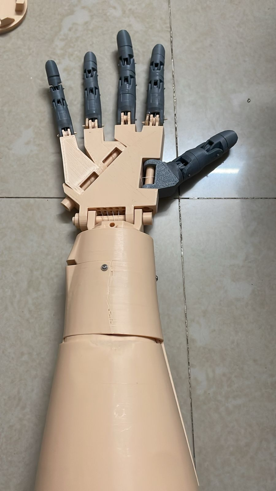
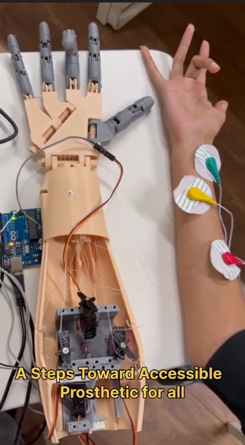

# EMG-Based Prosthetic Hand
This project demonstrates a prosthetic hand controlled using EMG (muscle) signals in real time.

## Overview
The system captures muscle signals using EMG sensors and processes the data to control finger movements. It enables real-time response based on human muscle activity.

## Features
- Processes EMG signal data to detect movement patterns  
- Implements control logic for real-time finger movement  
- Provides responsive and adaptive system behavior  

## System Architecture
- EMG sensors capture muscle signals  
- Signals are processed and filtered  
- Control logic maps signal patterns to movements  
- Arduino controls servo motors for real-time response  

## Working Process
1. EMG sensors detect muscle activity  
2. Signals are captured and processed  
3. Pattern recognition logic identifies movement intent  
4. Signals are mapped to servo motor actions  
5. Prosthetic hand performs real-time movement  

## Components Used
- EMG Sensors  
- Arduino Board  
- Servo Motors  
- Connecting Wires  
- Power Supply  

## Tech Stack
- Python  
- Arduino  

## Project Images
  
  

## Demo Videos
- [Demo Video 1](hand video.mp4)  
- [Demo Video 2](now_video -recent.mp4)  

## Description
This project focuses on building an assistive prosthetic system that reacts to EMG signals. The signals are processed and mapped to physical movements, enabling real-time control of a prosthetic hand.

## Applications
- Assistive technology for amputees  
- Human-computer interaction  
- Real-time embedded systems  

## Learnings
- Signal data processing and pattern recognition  
- Real-time system integration  
- Debugging hardware-software interactions  
- Building assistive technology solutions
